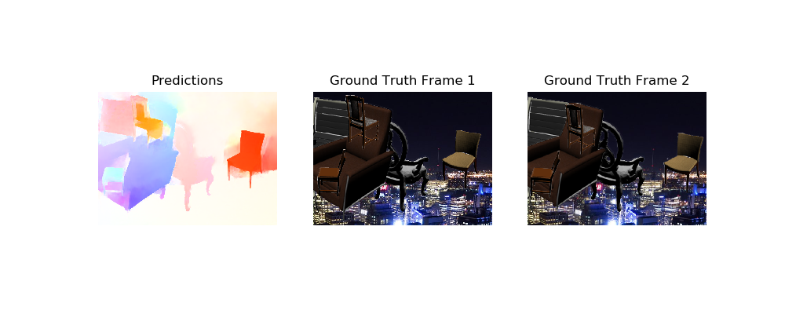

# SpyNet PyTorch 🏊🏼‍♀️🏃🏼‍♀️

Modern implementation of SpyNet in PyTorch, along some useful utilities
such as optical flow transformations.

## What SpyNet does?

As stated in the paper's abstract:

> We learn to compute optical flow by combining a classical spatial-pyramid formulation with deep learning. This estimates large motions in a coarse-to-fine approach by warping one image of a pair at each pyramid level by the current flow estimate and computing an update to the flow.

This model is 96% smaller the the FlowNet in terms of parameters.

## Inference 

```python
import spynet
import spynet.transfroms as T
from PIL import Image

tfms = T.Compose([
    T.ToTensor(),
    T.Normalize(mean=[.485, .406, .456], 
                std= [.229, .225, .224])
])

model = spynet.SpyNet.from_pretrained('sentinel')
model.eval()

frame1 = tfms(Image.open('..')).unsqueeze(0)
frame2 = tfms(Image.open('..')).unsqueeze(0)

flow = model((frame1, frame2))[0]
flow = spynet.flow.flow_to_image(flow)
Image.fromarray(flow).show()
```




## Finetuning the model

TBD

## References

- [SpyNet custom implementation by Simon Niklaus](https://github.com/sniklaus/pytorch-spynet/)
- [Original SpyNet implementation in torch lua](https://github.com/anuragranj/spynet)
- [FlowNet2 TF implementation by Sam Pepose](https://github.com/sampepose/flownet2-tf)
